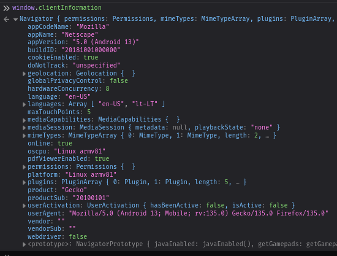

# Intro

Keywords: Rich text editor, WYSIWYG, WYSIWYG editor, Markdown editor

Readings:

- [Enhanced Editing with Input Events](https://webkit.org/blog/7358/enhanced-editing-with-input-events/)
- [Quill Rich Text Editor](https://quilljs.com/)
  - doesn't convert `**text**` to bold text

# Other

Needs to support: key entering, selecting, select all, cursor moving, cutting, copying, pasting, focus, IME

Even vscode.dev doesn't support caret position changing with space sliding on mobile but supports keyboard suggestions. Space and backspace breaks sometimes, virtual keyboard does not appear after first use. No text selection on mobile.
vscode uses hidden `<textarea>` for input collection (as expected, and apparently very common).

Discord mobile does support space sliding and updates its internal caret position and offers autocompletions based on that. it is likely that discord mobile isn't even web, it is like android widgets

Strange space sliding when going very fast (starts to select multiple elements) and it happens on `<input>` and `contenteditable` (tested on Firefox and webview, only happens on Firefox)

# Events

## selectionchange

Triggers when:

- input is focused
  - If Chromium: and if last selectable element wasn't current input
    - e.g. if after that `<button>` was focused then refocused current one won't trigger but if `<p>` was focused and the refocused current one, then it will trigger cuz `<button>` is unselectable and `<p>` is selectable
  - If Firefox: there's text already and only called once when focused first time and sometimes it resets when spamming smth
- select all
- caret is moved once focused, text is entered
- other selectable element is clicked for potential double click select (only triggers for document)
  - e.g. input is unfocused with mouse (only triggers for document)

Doesn't trigger when:

- element is unfocused with tab
- caret is on the edge and trying to move out of bounds and it gets clamped

Triggers for:

- input element: body, document, window, parent and input element
- contenteditable element: document

For the record, Firefox Linux and Firefox Android behavior matches.

Docs:

- [Document: selectionchange event](https://developer.mozilla.org/en-US/docs/Web/API/Document/selectionchange_event)
- [HTMLInputElement: selectionchange event (apparently experimental)](https://developer.mozilla.org/en-US/docs/Web/API/HTMLInputElement/selectionchange_event)
- [Selection object](https://developer.mozilla.org/en-US/docs/Web/API/Selection)

## input/beforeinput

`e.preventDefault()` only works for `beforeinput` and not for `input`.

Entered data comes in `e.data` and copied data comes in `e.dataTransfer`. If both are empty, it means deletion is requested.

Android suggestions select text what's in front that needs to be changed, removes it like backspace and appends changed part by entering text regularly.

Useful expressions:

- `e.target.textContent` (before change)
- `e.getTargetRanges()`

Docs:

- [DataTransfer](https://developer.mozilla.org/en-US/docs/Web/API/DataTransfer)
- [beforeinput event](https://developer.mozilla.org/en-US/docs/Web/API/Element/beforeinput_event)
- [input types](https://w3c.github.io/input-events/#interface-InputEvent-Attributes)

## window.visualViewport.resize

```js
const handleVisualViewportResize = (e) => {
  console.log(
    "[visual viewport resize]",
    e,
    e.target,
    window.screen,
    `innerHeight: ${window.innerHeight}; outerHeight: ${window.outerHeight}`,
    `scaledHeight: ${e.target.height * e.target.scale}`
  );
};

$effect(() => {
  window.visualViewport?.addEventListener("resize", handleVisualViewportResize);
  return () => {
    window.visualViewport?.removeEventListener(
      "resize",
      handleVisualViewportResize
    );
  };
});
```

Triggers when:

- zoon in end or when very slow once in a while
- zoom out periodically
- virtual keyboard opened (x2) and closed

Untested:

- screen split

Firefox Android `e.target.height * e.target.scale` is quite inconsistent while resizing with ±20 depending on speed, Chrome Android is better, has about ±5 inconsistency at worst, commonly it is ±0.005. Most likely that Chrome Android has way higher update rate and zoom in/out update frequency is same.

Chrome Android `innerHeight` and `outerHeight` is always the same except when screen split can be off by one (e.g. 387 inner and 388 outer) and most likely depends on some sort of rounding. Does not change when virtual keyboard is opened.

Firefox Android `outerHeight` and `innerHeight` difference is the same even when splitting - 105. Accessibility 125% size makes it 91 but when screen split it varies from 85 to 89. Does change when virtual keyboard is opened.

Chrome Android `scaledHeight` reduces in one go when virtual keyboard is opened. It breaks apart when virtual keyboard is opened in split mode and Chrome Android is top window because then virtual keybaord does not change `scaledHeight`, even `resize` is not called. Bottom kinda works but beware that it also increases main window height.

Firefox Android also falls flat for top split window trick.

I do not think there's any way to detect virtual keyboard minimization when screen is split and browser is the top window. And it is very common behavior to lose focus once virtual keyboard is minimized. TBF it is very rare case and prob could just have warning for that and cover other 95% of cases.

Unselecting is strange in split view, doesn't work sometimes and have to click elsewhere.

Hopefully, one day I can patch up Firefox Android and not have to add these hachy fixes on my end but have proper support.

Docs:

- [Visual Viewport API](https://developer.mozilla.org/en-US/docs/Web/API/Visual_Viewport_API)

# Testing

## Firefox Android 135.0a1

| Experiment name                                                                    | `innerHeight` | `outerHeight` | `diff` | `scaledHeight`     | `screenHeight` | `scale`                       |
| ---------------------------------------------------------------------------------- | ------------- | ------------- | ------ | ------------------ | -------------- | ----------------------------- |
| One window, 3 button nav, Firefox bottom bar, 100% text scale                      | 767           | 872           | 105    | 766.7999877929688  | 960            |                               |
| One window, 3 button nav, no Firefox bottom bar, 100% text scale                   | 872           | 872           | 0      | 872                | 960            |                               |
| One window, swipe nav, Firefox bottom bar, 100% text scale                         | 791           | 896           | 105    | 790.7999877929688  | 960            |                               |
| One window, swipe nav, no Firefox bottom bar, 100% text scale                      | 896           | 896           | 0      | 896                | 960            |                               |
| One window, swipe nav, Firefox bottom bar, 100% text scale, desktop site           | 1794          | 896           | -898   | 790.8024032329486  | 960            | on toggle initially scale = 1 |
| One window, swipe nav, no Firefox bottom bar, 100% text scale, desktop site        | 1899          | 896           | -1003  | 896.0032270992779  | 960            |                               |
| One window, hidden swipe nav, Firefox bottom bar, 100% text scale, desktop site    | 1848          | 920           | -928   | 814.8002463797857  | 960            |                               |
| One window, hidden swipe nav, no Firefox bottom bar, 100% text scale, desktop site | 1954          | 920           | -1034  | 920.0015554884812  | 960            |                               |
| One window, hidden swipe nav, Firefox bottom bar, 100% text scale                  | 815           | 920           | 105    | 814.8019381570703  | 960            | 0.9999614953994751            |
| One window, hidden swipe nav, no Firefox bottom bar, 100% text scale               | 920           | 920           | 0      | 919.9978996796563  | 960            | 0.9999614953994751            |
| One window, hidden swipe nav, Firefox top bar, 100% text scale                     | 815           | 920           | 105    | 814.8042326734212  | 960            | 0.9995757937431335            |
| One window, hidden swipe nav, no Firefox top bar, 100% text scale                  | 920           | 920           | 0      | 919.992929435608   | 960            | 0.9995757937431335            |
| One window, hidden swipe nav, Firefox bottom bar, 125% text scale                  | 645           | 736           | 91     | 645.0429030298692  | 760            | 0.9995757937431335            |
| One window, hidden swipe nav, no Firefox bottom bar, 125% text scale               | 728           | 736           | 8      | 728.3409265146402  | 760            | 0.9995757937431335            |
| One window, hidden swipe nav, no Firefox bottom bar, 200% text scale               | 460           | 460           | 0      | 460.004792482443   | 480            | 0.9995757937431335            |
| One window, hidden swipe nav, no Firefox bottom bar, 50% text scale                | 1840          | 1840          | 0      | 1840.0024533912292 | 1920           | 0.9995757937431335            |
| One window, hidden swipe nav, Firefox bottom bar, 4th tick font size               | 611           | 708           | 97     | 611.0985079895545  | 720            | 0.999588668346405             |
| One window, hidden swipe nav, no Firefox bottom bar, 4th tick font size            | 690           | 708           | 18     | 689.9993898137109  | 720            | 0.999588668346405             |
| One window, hidden swipe nav, Firefox bottom bar, 4th tick display size            | 815           | 920           | 105    | 814.8036518475383  | 960            | 0.9997795224189758            |
| One window, hidden swipe nav, no Firefox bottom bar, 4th tick display size         | 815           | 920           | 105    | 956.4057256612396  | 960            | 0.9997795224189758            |

### Data

| Experiment name                                                                 | `outerHeight` | `innerHeight` | `diff` | `devicePixelRatio` | `scale`            | `height`           | `scaledHeight`     | `offsetTop`         | `pageTop`          | `pageYOffset`      | `screenHeight` | `screenAvailHeight` | `screenTop` | `screenAvailTop` | `mozOrientation` | `mozInnerScreenX` | `mozInnerScreenY`  |
| ------------------------------------------------------------------------------- | ------------- | ------------- | ------ | ------------------ | ------------------ | ------------------ | ------------------ | ------------------- | ------------------ | ------------------ | -------------- | ------------------- | ----------- | ---------------- | ---------------- | ----------------- | ------------------ |
| One window, hidden swipe nav, no Firefox bottom bar                             | 920           | 920           | 0      | 2.5                | 0.9997685551643372 | 920.2166748046875  | 920.0036954076131  | -0.199981689453125  | 508.73333740234375 | 508.9333190917969  | 960            | 960                 | 0           | 0                | portrait-primary | 0                 | 40                 |
| One window, hidden swipe nav, Firefox bottom bar                                | 920           | 815           | 105    | 2.5                | 0.9997685551643372 | 814.9833374023438  | 814.7947137177507  | -0.2666015625       | 5915.88330078125   | 5916.14990234375   | 960            | 960                 | 0           | 0                | portrait-primary | 0                 | 40                 |
| One window, hidden swipe nav, no Firefox top bar                                | 920           | 920           | 0      | 2.5                | 0.9997685551643372 | 920.2166748046875  | 920.0036954076131  | 0.08333587646484375 | 76.81666564941406  | 76.73332977294922  | 960            | 960                 | 0           | 0                | portrait-primary | 0                 | 52.400001525878906 |
| One window, hidden swipe nav, Firefox top bar                                   | 920           | 815           | 105    | 2.5                | 0.9997685551643372 | 814.9833374023438  | 814.7947137177507  | -0.36669921875      | 6250.64990234375   | 6251.0166015625    | 960            | 960                 | 0           | 0                | portrait-primary | 0                 | 40                 |
| One window, hidden swipe nav, Firefox top bar, zoomed in                        | 920           | 920           | 0      | 2.5                | 3.3508217334747314 | 274.5666809082031  | 920.0240016752286  | 390.3166809082031   | 805.6666870117188  | 415.3500061035156  | 960            | 960                 | 0           | 0                | portrait-primary | 0                 | 40.400001525878906 |
| One window, hidden swipe nav, Firefox top bar, slow raise                       | 920           | 815           | 105    | 2.5                | 0.999884307384491  | 814.9000244140625  | 814.8057464988597  | 0.116668701171875   | 324.51666259765625 | 324.3999938964844  | 960            | 960                 | 0           | 0                | portrait-primary | 0                 | 94.4000015258789   |
| One window, hidden swipe nav, Firefox bottom bar, slow raise                    | 920           | 815           | 105    | 2.5                | 0.999884307384491  | 814.9000244140625  | 814.8057464988597  | -0.283203125        | 2428.050048828125  | 2428.333251953125  | 960            | 960                 | 0           | 0                | portrait-primary | 0                 | 40                 |
| One window, 3 button nav, no Firefox bottom bar                                 | 872           | 872           | 0      | 2.5                | 0.999884307384491  | 872.0999755859375  | 871.9990800587766  | -0.199951171875     | 2653.9833984375    | 2654.183349609375  | 960            | 960                 | 0           | 0                | portrait-primary | 0                 | 40                 |
| One window, 3 button nav, Firefox bottom bar                                    | 872           | 767           | 105    | 2.5                | 0.999884307384491  | 766.8833618164062  | 766.7946390744873  | -0.2333984375       | 4200.35009765625   | 4200.58349609375   | 960            | 960                 | 0           | 0                | portrait-primary | 0                 | 40                 |
| Top half split window, 3 button nav, no Firefox bottom bar                      | 443           | 338           | 105    | 2.5                | 0.999884307384491  | 338.0333251953125  | 337.99421723579144 | 0.08331298828125    | 577.7166748046875  | 577.6333618164062  | 960            | 960                 | 0           | 0                | portrait-primary | 0                 | 40                 |
| Top half split window, 3 button nav, Firefox bottom bar                         | 443           | 338           | 105    | 2.5                | 0.999884307384491  | 338.0333251953125  | 337.99421723579144 | -0.1500244140625    | 1486.683349609375  | 1486.8333740234375 | 960            | 960                 | 0           | 0                | portrait-primary | 0                 | 40                 |
| Top 1/4 split window, 3 button nav, no Firefox bottom bar                       | 243           | 243           | 0      | 2.5                | 0.999884307384491  | 242.8333282470703  | 242.80523422419265 | 0.0999908447265625  | 154.51666259765625 | 154.4166717529297  | 960            | 960                 | 0           | 0                | portrait-primary | 0                 | 40                 |
| Top 1/4 split window, 3 button nav, Firefox bottom bar                          | 243           | 138           | 105    | 2.5                | 0.999884307384491  | 137.61666870117188 | 137.6007474688322  | 0.0166015625        | 2488.86669921875   | 2488.85009765625   | 960            | 960                 | 0           | 0                | portrait-primary | 0                 | 40                 |
| Bottom half split window, 3 button nav, no Firefox bottom bar                   | 419           | 419           | 0      | 2.5                | 0.999884307384491  | 418.8500061035156  | 418.80154825080353 | 0.116668701171875   | 316.1499938964844  | 316.0333251953125  | 960            | 960                 | 0           | 0                | portrait-primary | 0                 | 493.20001220703125 |
| Bottom half split window, 3 button nav, Firefox bottom bar                      | 419           | 314           | 105    | 2.5                | 0.999884307384491  | 313.6333312988281  | 313.59704623841935 | 0.0166015625        | 6487.11669921875   | 6487.10009765625   | 960            | 960                 | 0           | 0                | portrait-primary | 0                 | 493.20001220703125 |
| Bottom 1/4 split window, 3 button nav, no Firefox bottom bar                    | 219           | 219           | 0      | 2.5                | 0.999884307384491  | 218.8333282470703  | 218.80801084696486 | 0                   | 176.4166717529297  | 176.4166717529297  | 960            | 960                 | 0           | 0                | portrait-primary | 0                 | 693.2000122070312  |
| Bottom 1/4 split window, 3 button nav, Firefox bottom bar                       | 219           | 114           | 105    | 2.5                | 0.999884307384491  | 113.61666870117188 | 113.60352409160441 | 0.08349609375       | 5022.5             | 5022.41650390625   | 960            | 960                 | 0           | 0                | portrait-primary | 0                 | 693.2000122070312  |
| One window, 3 button nav, no Firefox bottom bar, virtual keyboard               | 566           | 872           | -306   | 2.5                | 0.999884307384491  | 565.6666870117188  | 565.601243553192   | -0.08349609375      | 6409.5498046875    | 6409.63330078125   | 960            | 960                 | 0           | 0                | portrait-primary | 0                 | 40                 |
| One window, 3 button nav, Firefox bottom bar, virtual keyboard                  | 566           | 767           | -201   | 2.5                | 1                  | 460.3999938964844  | 460.3999938964844  | 0                   | 0                  | 0                  | 960            | 960                 | 0           | 0                | portrait-primary | 0                 | 40                 |
| Top 3/4 split window, 3 button nav, no Firefox bottom bar, virtual keyboard     | 566           | 643           | -77    | 2.5                | 1                  | 565.5999755859375  | 565.5999755859375  | 0                   | 6638.39990234375   | 6638.39990234375   | 960            | 960                 | 0           | 0                | portrait-primary | 0                 | 40                 |
| Top 3/4 split window, 3 button nav, Firefox bottom bar, virtual keyboard        | 566           | 538           | 28     | 2.5                | 1                  | 460.3999938964844  | 460.3999938964844  | 0                   | 0                  | 0                  | 960            | 960                 | 0           | 0                | portrait-primary | 0                 | 40                 |
| Bottom half split window, 3 button nav, no Firefox bottom bar, virtual keyboard | 450           | 467           | -17    | 2.5                | 1                  | 450.3999938964844  | 450.3999938964844  | -31.599609375       | 6831.2001953125    | 6862.7998046875    | 960            | 960                 | 0           | 0                | portrait-primary | 0                 | 155.1999969482422  |
| Bottom half split window, 3 button nav, Firefox bottom bar, virtual keyboard    | 450           | 362           | 88     | 2.5                | 1                  | 345.20001220703125 | 345.20001220703125 | 0                   | 0                  | 0                  | 960            | 960                 | 0           | 0                | portrait-primary | 0                 | 155.1999969482422  |
| Bottom 1/4 split window, 3 button nav, no Firefox bottom bar, virtual keyboard  | 267           | 267           | 0      | 2.5                | 1                  | 266.79998779296875 | 266.79998779296875 | 0                   | 7120               | 7120               | 960            | 960                 | 0           | 0                | portrait-primary | 0                 | 338.79998779296875 |
| Bottom 1/4 split window, 3 button nav, Firefox bottom bar, virtual keyboard     | 267           | 162           | 105    | 2.5                | 1                  | 161.60000610351562 | 161.60000610351562 | 0                   | 0                  | 0                  | 960            | 960                 | 0           | 0                | portrait-primary | 0                 | 338.79998779296875 |
| Bottom 3/4 split window, 3 button nav, no Firefox bottom bar, virtual keyboard  | 510           | 667           | -157   | 2.5                | 1                  | 510.3999938964844  | 510.3999938964844  | 7.60009765625       | 6727.2001953125    | 6719.60009765625   | 960            | 960                 | 0           | 0                | portrait-primary | 0                 | 95.19999694824219  |
| Bottom 3/4 split window, 3 button nav, Firefox bottom bar, virtual keyboard     | 510           | 562           | -52    | 2.5                | 1                  | 405.20001220703125 | 405.20001220703125 | 0                   | 0                  | 0                  | 960            | 960                 | 0           | 0                | portrait-primary | 0                 | 95.19999694824219  |

Overlay virtual keyboard: no change
Top half, top 1/4, split window virtual keyboard: no change

```js
const handleVisualViewportResize = (e) => {
  // console.log(
  //   "[visual viewport resize]",
  //   e,
  //   e.target,
  //   window.screen,
  //   `innerHeight: ${window.innerHeight}; outerHeight: ${window.outerHeight}; diff: ${window.outerHeight - window.innerHeight};`,
  //   `scaledHeight: ${e.target.height * e.target.scale}; scale: ${e.target.scale}; availHeight: ${window.screen.availHeight}; height: ${window.screen.height}; devicePixelRatio: ${window.devicePixelRatio}`
  // );
  console.log("[visual viewport resize]");
  console.log(
    `|${window.outerHeight}|${window.innerHeight}|${
      window.outerHeight - window.innerHeight
    }|${window.devicePixelRatio}|${e.target.scale}|${e.target.height}|${
      e.target.scale * e.target.height
    }|${e.target.offsetTop}|${e.target.pageTop}|${window.pageYOffset}|${
      window.screen.height
    }|${window.screen.availHeight}|${window.screen.top}|${
      window.screen.availTop
    }|${window.screen.mozOrientation}|${window.mozInnerScreenX}|${
      window.mozInnerScreenY
    }|`
  );
};
```

### Accessibility

| Firefox text scale | `devicePixelRatio` | Diff rate          |
| ------------------ | ------------------ | ------------------ |
| 50%                | 1.25               |                    |
| 100%               | 2.5                |                    |
| 125%               | 3.1578947368421053 | x1.263157894736842 |
| 200%               | 5                  |                    |

| Android font size tick | `devicePixelRatio` | Diff rate           |
| ---------------------- | ------------------ | ------------------- |
| 1st                    | 2.142857142857143  | x0.8571428571428571 |
| 3rd                    | 2.857142857142857  | x1.1428571428571428 |
| 4th                    | 3.3333333333333335 | x1.3333333333333335 |

Android display size doesn't influence `devicePixelRatio`.

### Client info



| Experiment name   | `locationbar` | `menubar` | `personalbar` | `statusbar` | `toolbar` |
| ----------------- | ------------- | --------- | ------------- | ----------- | --------- |
| Basically anytime | true          | true      | true          | true        | true      |

`window`: clientInformation, fullScreen, locationbar, menubar, mozInnerScreenX: 0, mozInnerScreenY: 40, navigator, onchange, oncuechange, ondevicemotion, ondeviceorientation, ondeviceorientationabsolute, onmozfullscreenchange: ​​
onmozfullscreenerror, onpagehide, onpageshow, onpopstate, onratechange, onreset, outerHeight, outerWidth, pageXOffset, pageYOffset, performance, personalbar, screen, screenLeft, screenTop, screenX, screenY, scrollMaxX, scrollMaxY, scrollX, scrollY, statusbar, toolbar, visualViewport

`document`: fullscreen, fullscreenElement, fullscreenEnabled, mozFullScreen, mozFullScreenElement, mozFullScreenEnabled, (same events as `window`), timeline, exitFullscreen(), mozCancelFullScreen(),

### Other

Firefox bottom bar minimizes gradually if scroll speed is slow

Other untested factors:

- Firefox
  - [x] Desktop site
  - [x] Settings > Customize > Address bar location > Top
  - [x] Settings > Customize > Address bar location > Scroll to hide address bar and toolbar
  - Settings > Accessibility > Automatic font sizing
  - [x] Settings > Accessibility > Font size
  - Extensions?
  - about:config
  - Firefox Focus vs Firefox Nightly
  - Open in... external page preview
  - zooming
- Android
  - Display > Display size and text
  - Display > Auto-rotate screen
  - Display > Full screen
  - Display > Swipe to split
  - [x] Display > Gestures > System navigation > Gesture navigation > Navigation Bar > Hide
  - [x] Accessibility > Display size and text
  - [x] Accessibility > Magnification
  - [x] Accessibility > Interaction controls > Accessibility Menu
  - System > Languages & input > Keyboards
  - System > Developer options > Apps > Force activities to be resizable
  - System > Developer options > Apps > Enable freeform windows
  - System > Developer options > Apps > Force desktop mode
  - System > Developer options > Apps > Enable non-resizable in multi window
  - Different virtual keyboards
  - Resizing virtual keyboard while it is open
  - Different custom status bars
  - External mouse and keyboard
  - Different phones, tablets, ROMs

# Edge cases

- Deleting selected text requires selecting text and it changes focus to that element and if that element is not `<input>`, `<textarea>` or `contenteditable`, virtual keyboard will be closed and no delete button will be visible. Unless there's some way to spawn virtual keyboard without losing focus or selection. It is possible to use OS-specific Cut button but is cumbersome. On some of editors once you select their custom textarea and then select text, it still shows virtual keyboard (but also has some other weird selection behaviors). And if u close virtual keyboard but still select that text, it won't cut it, virtual keyboard already has to be opened.

# Problems

Main issue is proper mobile support and, as such, virtual keyboard. Virtual keyboard has many events which only happen through `beforeinput` and `input` and only specific elements let you have virtual keyboard opened. `contexteditable` already has everything virtual keyboard in place but is troublesome to control and filter input. `beforeinput` event is the only place to cancel all virtual keyboard events and it only gives the input type, input data, modified range and previous element text content. Input types range from simple insert, delete backwards and forwards up to delete word backwards [[1]]. Modified range could help with reimplementing modification logic and then customize.(TODO)

Oh wait, even `contexteditable` only shows virtual keyboard once selected text when virtual keyboard is already opened. So that makes `contexteditable` nothing more special than other methods. Time to find some fixes for that ig.

[1]: https://w3c.github.io/input-events/#interface-InputEvent-Attributes
